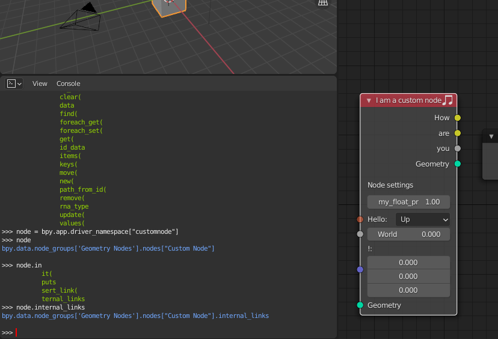
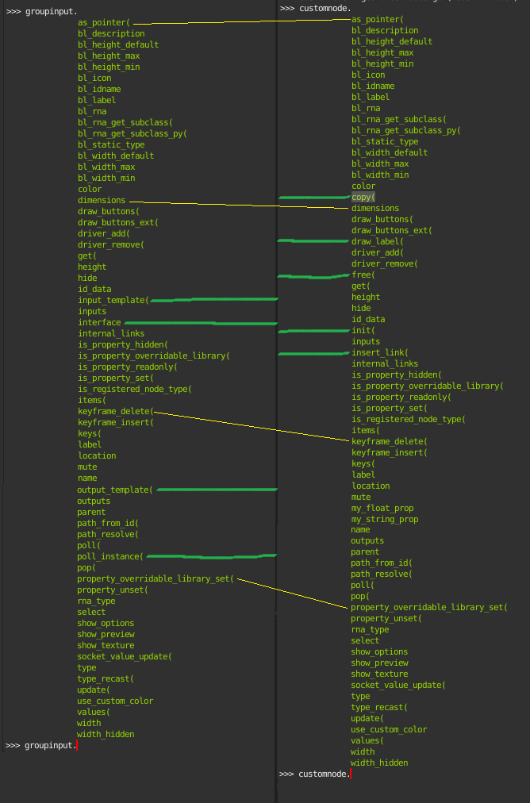

**A word of warning**
 * I don't work a lot with Python
 * ~~This is still crashing Blender once you connect any output link of the custom node~~
 * I am just experimenting to see what is possible

**Install**
 * Just clone this repo in your `blender-2.92.0/2.92/scripts/addons/` folder

**Debugging the last added node**

Just go to the scripting tab and write:
```python
node = bpy.app.driver_namespace["customnode"]
```

Then use autocomplete etc. like:



**Interesting files to learn from**
 * [Scripting tag -> Templates -> Python -> Custom Nodes](/reference/custom_nodes.py)
 * [blender-2.92.0/2.92/scripts/startup/nodeitems_builtins.py](./reference/nodeitems_builtins.py)
 * [blender-2.92.0/2.92/scripts/startup/bl_operators/geometry_nodes.py](./reference/geometry_nodes.py)
 * [blender-2.92.0/2.92/scripts/startup/nodeitems_builtins.py](./reference/nodeitems_builtins.py)
 * [blender-2.92.0/2.92/scripts/modules/nodeitems_utils.py](./reference/nodeitems_utils.py)

**Preview**


**Useful snippets**

```python
geonodes = bpy.data.node_groups['Geometry Nodes']
groupinput = geonodes.nodes.get("Group Input")
groupoutput = geonodes.nodes.get("Group Output")

tr = geonodes.nodes.get("Transform")
# Remove default link
geonodes.links.remove(geonodes.links[0])

# If it exists:
customnode = geonodes.nodes['Custom Node']


```

**Stack trace of crash**

```
Stack trace:
blender.exe         :0x00007FF6AB8C1210  GeometryNodesEvaluator::get_unlinked_input_value
blender.exe         :0x00007FF6AB8C1040  GeometryNodesEvaluator::get_input_value
blender.exe         :0x00007FF6AB8BF370  GeometryNodesEvaluator::compute_output_and_forward
blender.exe         :0x00007FF6AB8BF8E0  GeometryNodesEvaluator::execute
blender.exe         :0x00007FF6AB8BEAF0  compute_geometry
blender.exe         :0x00007FF6AB8C1420  modifyGeometry
blender.exe         :0x00007FF6AB6D50B0  modifier_modify_mesh_and_geometry_set
blender.exe         :0x00007FF6AB6D3D30  mesh_calc_modifiers
blender.exe         :0x00007FF6AB6D3A30  mesh_build_data
blender.exe         :0x00007FF6AB6D60F0  makeDerivedMesh
blender.exe         :0x00007FF6AB6B55D0  BKE_object_handle_data_update
blender.exe         :0x00007FF6AB6B5300  BKE_object_eval_uber_data
blender.exe         :0x00007FF6AF37A8F0  std::_Func_impl_no_alloc<std::_Binder<std::_Unforced,void (__cdecl&)(Depsgraph * __ptr64,Main * __p
blender.exe         :0x00007FF6AF378CD0  blender::deg::`anonymous namespace'::evaluate_node
blender.exe         :0x00007FF6AF378C80  blender::deg::`anonymous namespace'::deg_task_run_func
tbb.dll             :0x00007FFB00BA51D0  tbb::interface7::internal::isolate_within_arena
blender.exe         :0x00007FF6AF3FDDD0  tbb::internal::function_task<Task>::execute
tbb.dll             :0x00007FFB00BB37A0  tbb::recursive_mutex::scoped_lock::internal_try_acquire
tbb.dll             :0x00007FFB00BB37A0  tbb::recursive_mutex::scoped_lock::internal_try_acquire
tbb.dll             :0x00007FFB00BA51D0  tbb::interface7::internal::isolate_within_arena
tbb.dll             :0x00007FFB00BAA490  tbb::task_scheduler_init::terminate
tbb.dll             :0x00007FFB00BB19C0  tbb::thread_bound_filter::try_process_item
tbb.dll             :0x00007FFB00BB19C0  tbb::thread_bound_filter::try_process_item
ucrtbase.dll        :0x00007FFB148B1B20  configthreadlocale
KERNEL32.DLL        :0x00007FFB14B17020  BaseThreadInitThunk
ntdll.dll           :0x00007FFB16ADD220  RtlUserThreadStart
```

Relevant `C++` source: (Relevant Blender C++)[https://github.com/blender/blender/tree/master/source/blender/nodes]

Relevant `C++` source: (Relevant Blender C++)[https://github.com/blender/blender/tree/master/source/blender/nodes]

**Figure out what is different between my custom node and a working node**


