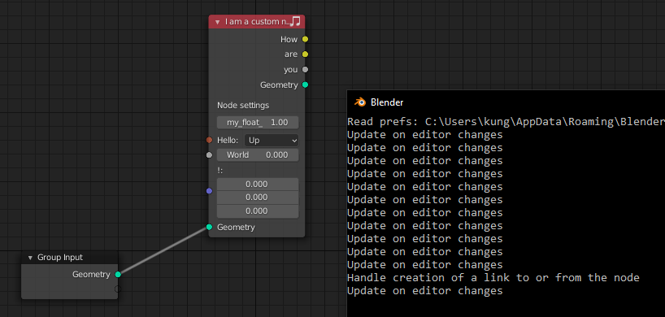

**A word of warning**
 * I don't work a lot with Python
 * This is still crashing Blender once you connect any output link of the custom node
 * I am just experimenting to see what is possible

**Install**
 * Just clone this repo in your `blender-2.92.0/2.92/scripts/addons/` folder

**Interesting files to learn from**
 * [Scripting tag -> Templates -> Python -> Custom Nodes](/reference/custom_nodes.py)
 * [blender-2.92.0/2.92/scripts/startup/nodeitems_builtins.py](./reference/nodeitems_builtins.py)
 * [blender-2.92.0/2.92/scripts/startup/bl_operators/geometry_nodes.py](./reference/geometry_nodes.py)
 * [blender-2.92.0/2.92/scripts/startup/nodeitems_builtins.py](./reference/nodeitems_builtins.py)
 * [blender-2.92.0/2.92/scripts/modules/nodeitems_utils.py](./reference/nodeitems_utils.py)

**Preview**

